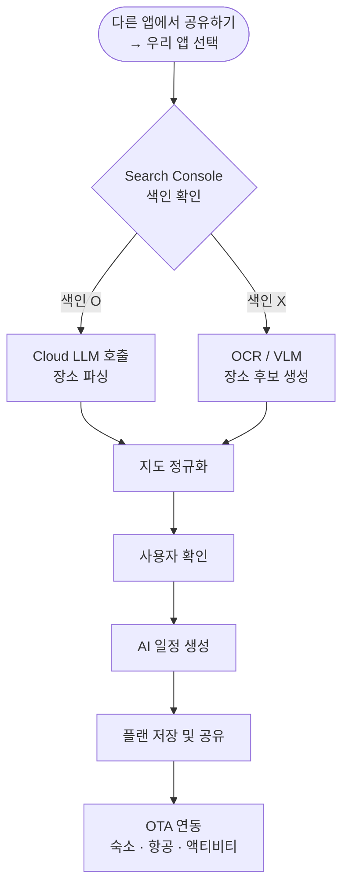
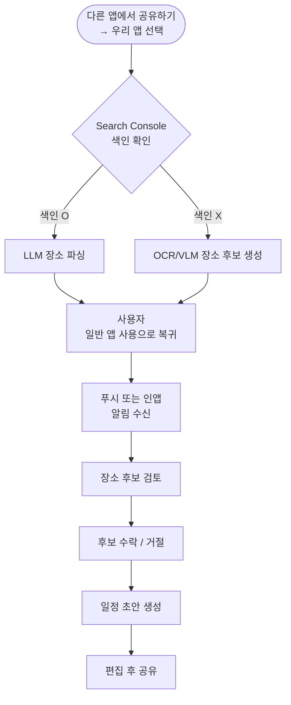

## 제품 범위

### 지원 입력 (모바일 MVP)

- YouTube Shorts 링크
- Instagram Reels 링크
- 웹 블로그 URL
- Naver Maps URL
- Kakao Maps URL
- Google Maps URL

> 웹 버전은 장소 추출 기능을 제외한 일정 조회 및 공유 기능을 지원한다.
> 

### 핵심 제품 파이프라인

### 핵심 제품 기능

| 기능 | 설명 | 우선순위 | 링크 수집 | 지원 URL 입력 및 출처 분류 | P0 |
| --- | --- | --- | --- | --- | --- |
| 백그라운드 분석 | 파생 신호 기반 비동기 추출 | P0 | 후보 검토 | 장소 후보와 신뢰도 표시 | P0 |
| 장소 정규화 | 지도 기준 정식 엔티티로 매핑 | P0 | 일정 생성 | 확정 장소 기반 여행 계획 초안 생성 | P0 |
| 계획 공유 | 저장된 일정을 링크 또는 앱 화면으로 공유 | P1 | 장소 재사용 | 이전 추출 장소를 차후 여행에 재활용 | P1 |

---

## 제품 경험

### UX 원칙

1. **Fire-and-Forget**: 사용자는 링크만 제출하고 결과를 기다리며 머무르지 않아야 한다.
2. **No Forced Replay**: 플랫폼 내에서 영상을 다시 보게 만들지 않는다.
3. **Human-in-the-Loop**: 시스템은 후보를 제안하고, 사용자 확인이 정확성을 완성한다.
4. **Incremental Trust**: 신뢰도와 근거를 사용자에게 보여준다.
5. **Cross-Platform Consistency**: 일정 조회·공유 등 웹에서 제공하는 기능은 모바일과 동일한 데이터 기준을 따른다.

### 주요 사용자 플로우

### 핵심 UX 요구사항

분석은 반드시 비동기로 동작해야 하며, 앱 백그라운드 전환, 네트워크 불안정, 세션 중단 상황에서도 복원 가능해야 한다.

---

## 기능 요구사항

### 링크 수집

- 시스템은 입력된 URL이 지원 플랫폼인지 검증해야 한다.
- 시스템은 출처 플랫폼을 식별하고 적절한 추출 경로로 라우팅해야 한다.
- 시스템은 처리 및 감사에 필요한 최소 메타데이터만 저장해야 한다.

### 링크 전처리 파이프라인

- 시스템은 수신된 링크를 Google Search Console API로 색인 여부를 먼저 확인해야 한다.
- 색인된 경우: 클라우드 LLM을 호출하여 텍스트 기반으로 장소를 파싱한다.
- 색인되지 않은 경우: OCR 및 VLM(Vision Language Model) 파이프라인으로 전환하여 장소 후보를 생성한다.
- 시스템은 원본 비디오 바이트를 영구 저장해서는 안 된다.

### 장소 후보 생성

- 시스템은 신뢰도 점수가 포함된 순위형 장소 후보를 생성해야 한다.
- 시스템은 캡션 문구, OCR 조각, 전사 구문 같은 근거를 함께 보여줘야 한다.
- 하나의 소스가 여러 장소를 언급하는 경우 복수 후보를 지원해야 한다.

### 장소 정규화

- 시스템은 외부 지도 공급자 기준으로 후보를 검증해야 한다.
- 시스템은 정규화된 이름, 좌표, 카테고리, 외부 place ID를 확보해야 한다.
- 시스템은 서로 다른 소스에서 동일 장소로 수렴하는 데이터를 중복 제거해야 한다.

### 사용자 확인

- 시스템은 일정 생성 전에 사용자가 후보를 수락, 거절, 수정할 수 있게 해야 한다.
- 추출 신뢰도가 낮은 경우 수동 검색 기능을 제공해야 한다.
- 사용자 확인 이력은 향후 후보 랭킹 개선에 활용할 수 있어야 한다.

### 여행 계획 생성

- 시스템은 확정된 장소 엔티티를 기반으로 일정 초안을 생성해야 한다.
- 일정은 방문 순서, 예상 체류 시간, 일자 그룹을 포함해야 한다.
- 사용자는 생성 후 수동으로 순서를 재배치할 수 있어야 한다.

### OTA 연동

- 완성된 일정에서 숙소, 항공, 액티비티 예약을 OTA로 링크해야 한다.
- 시스템은 일정 날짜와 장소 정보를 기반으로 OTA 직접 연결 URL을 생성해야 한다.
- 수수료는 제휴 OTA의 어필리에이트 프로그램 기반으로 정산한다.
- MVP 이후 단계에서 제휘사를 확대한다 (1차 타겟: 숙소 OTA).

## 플랫폼 요구사항

### 모바일 (MVP)

- iOS/Android 앱을 우선 구현한다.
- 공유하기(Share Extension / Intent) 기능을 통해 링크를 수신해야 한다.
- iOS는 `AVAssetImageGenerator`를 사용해 프레임을 캡처해야 한다. (OCR/VLM 경로 사용 시)
- Android는 `MediaMetadataRetriever`를 사용해 프레임을 캡처해야 한다. (OCR/VLM 경로 사용 시)

### 웹 (MVP 이후)

- 장소 추출 기능을 제공하지 않는다.
- 모바일에서 생성된 플랜의 조회, 편집, 공유 기능을 제공한다.