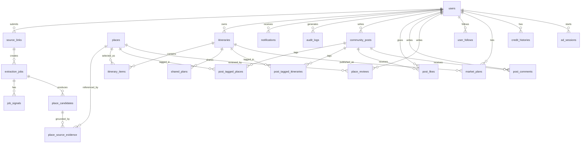

## 데이터 저장 전략

- 주 저장소: PostgreSQL + PostGIS + pgvector
- 캐시/작업 상태: Redis
- 임시 추출물: TTL 강제 오브젝트 스토리지
- 원본 영상/이미지 장기 저장 금지

## 핵심 엔터티

- users: 사용자 계정/로컬/환경설정 (credit_balance 캐시 포함)
- source_links: 제출된 원본 URL
- extraction_jobs: 분석 작업 단위
- job_signals: OCR/전사/비전 등 신호
- place_candidates: 후보 장소 + 신뢰도
- places: 정규화된 장소 마스터
- place_source_evidence: 장소-근거 연결
- itineraries: 사용자 일정
- itinerary_items: 일정 상세 항목
- shared_plans: 공유 설정/링크
- notifications: 알림 이력
- audit_logs: 감사 로그
- market_plans: 플랜 마켓 등록 정보
- credit_histories: 크레딧 적립/차감 내역
- ad_sessions: 광고 시청 세션

## ERD



## 주요 테이블 스키마

### users

| 컬럼 | 타입 | 설명 |
| --- | --- | --- |
| id | UUID | PK |
| email | varchar | nullable |
| nickname | varchar | 기본값: 형용사+동물+숫자 조합 자동 생성 (예: 이상한 여우 8237) |
| avatar_url | varchar | 프로필 사진 URL. 기본값: 닉네임 동물 기반 아바타 자동 생성. nullable |
| locale | varchar | 예: ko-KR |
| home_region | varchar | 선호 지역 |
| map_provider | enum('kakao','google') | 선호 지도 앱. 기본값: kakao |
| credit_balance | integer | 현재 크레딧 잔액 캐시. credit_histories 합산과 동기화. 기본값: 0 |
| created_at | timestamptz | 생성 시각 |

### source_links

| 컬럼 | 타입 | 설명 |
| --- | --- | --- |
| id | UUID | PK |
| user_id | UUID | FK([users.id](http://users.id)) |
| source_type | enum('youtube_short','instagram_reel') | 플랫폼 타입 |
| url | text | 제출 URL |
| normalized_url_hash | varchar | 중복 방지용 |
| status | enum('pending','processing','done','failed') | 처리 상태 |
| visibility | enum('private','public') | 기본값: private. public이면 S-05 출처 영상 섹션에 노출 |
| submitted_at | timestamptz | 제출 시각 |

### extraction_jobs

| 컬럼 | 타입 | 설명 |
| --- | --- | --- |
| id | UUID | PK |
| source_link_id | UUID | FK(source_links.id) |
| job_status | enum('pending','processing','done','failed') | 상태 머신 값 |
| signal_count | integer | 유효 신호 수 |
| error_code | varchar | nullable |
| started_at | timestamptz | 시작 시각 |
| completed_at | timestamptz | 완료 시각. nullable |

### place_candidates

| 컬럼 | 타입 | 설명 |
| --- | --- | --- |
| id | UUID | PK |
| job_id | UUID | FK(extraction_jobs.id) |
| candidate_name | varchar | 후보 장소명 |
| confidence_score | numeric(5,4) | 0.0000~1.0000 |
| rank_order | integer | 정렬 순위 |
| provider_match_json | jsonb | 지도 매칭 근거 |
| requires_confirmation | boolean | 사용자 확인 필요 여부 |
| status | enum('proposed','accepted','rejected','edited') | 후보 상태 |

### places

> `embedding` 컬럼은 pgvector 확장을 통해 유사 장소 검색에 사용된다. 장소 저장 시 `canonical_name + category + 추출 근거 텍스트`를 임베딩해 함께 저장한다.
> 

| 컬럼 | 타입 | 설명 |
| --- | --- | --- |
| id | UUID | PK |
| canonical_name | varchar | 정규화 이름 |
| latitude | numeric(9,6) | 위도 |
| longitude | numeric(9,6) | 경도 |
| geom | geography(Point,4326) | 공간 인덱스 (PostGIS) |
| category | enum('attraction','restaurant','cafe','accommodation','nature','etc') | 장소 카테고리. DB는 영문 식별자로 저장, UI에서 다국어 레이블로 변환 |
| country_code | varchar | 국가 코드 (ISO 3166-1 alpha-2) |
| google_place_id | varchar | nullable |
| kakao_place_id | varchar | nullable |
| thumbnail_url | varchar | 장소 대표 썸네일 URL. nullable. 폴백 우선순위에 따라 채워짐 |
| thumbnail_source | enum('flickr','wikimedia','google_places') | 썸네일 출처 |
| **embedding** | **vector(1536)** | **pgvector. 유사 장소 검색용** |
| created_at | timestamptz | 생성 시각 |

### 썸네일 폴백 전략

> 한국·일본·동남아 여행 관광지 서비스 특성을 반영한 3단계 폴백. 무료 API를 최대한 활용하고, 유료 API는 마지막 수단으로 1회 호출 후 캐싱한다.
> 

| 순위 | 소스 | 방법 | 비용 | 특징 |
| --- | --- | --- | --- | --- |
| 1 | **Flickr API** | 좌표 기반 CC 라이선스 사진 검색 | 무료 | 여행 사진 특화. 한·일·동남아 관광지 커버율 최고 |
| 2 | **Wikimedia Commons** | 좌표 기반 geosearch | 무료 | 랜드마크·관광명소 커버율 높음. CC 라이선스, 저작권 걱정 없음 |
| 3 | **Google Places Photos** | google_place_id로 1회 호출 → Object Storage 캐싱 | 저장 시 1회 $0.007 | 로컬 맛집·카페 등 커버. 캐시 후 재호출 없음 |

**Flickr 호출 예시** (반경 100m, CC 라이선스, 인기순)

```
GET https://api.flickr.com/services/rest/
  ?method=flickr.photos.search
  &lat={lat}&lon={lng}
  &radius=0.1
  &license=1,2,4,5,9,10
  &sort=interestingness-desc
  &extras=url_m,url_z,url_l
  &per_page=5
  &format=json
```

**Wikimedia Commons 호출 예시** (반경 200m)

```
GET https://commons.wikimedia.org/w/api.php
  ?action=query
  &generator=geosearch
  &ggsprimary=all
  &ggsnamespace=6
  &ggsradius=200
  &ggscoord={lat}|{lng}
  &prop=imageinfo
  &iiprop=url
  &iiurlwidth=600
  &format=json
```

**Google Places Photos 호출 예시** (장소 저장 시 1회)

```
GET /maps/api/place/details/json
  ?place_id={google_place_id}
  &fields=photos
  &key=API_KEY
→ photo_reference 추출 → Object Storage 저장 → thumbnail_url 업데이트
```

유사 장소 검색 쿼리:

```sql
SELECT * FROM places
ORDER BY embedding <-> $1
LIMIT 10;
```

### itineraries

| 컬럼 | 타입 | 설명 |
| --- | --- | --- |
| id | UUID | PK |
| user_id | UUID | FK([users.id](http://users.id)) |
| title | varchar | 플랜 제목 |
| destination_region | varchar | 여행지 |
| start_date | date | 출발일 |
| end_date | date | 도착일 |
| party_size | integer | 여행 인원 수 |
| status | enum('draft','confirmed','completed') | 플랜 상태 |
| visibility | enum('private','public') | 공개 범위. 기본값: private |
| created_at | timestamptz | 생성 시각 |

### itinerary_items

| 컬럼 | 타입 | 설명 |
| --- | --- | --- |
| id | UUID | PK |
| itinerary_id | UUID | FK([itineraries.id](http://itineraries.id)) |
| place_id | UUID | FK([places.id](http://places.id)) |
| day_index | integer | 여행 일차. null이면 미배치 풀 |
| sort_order | integer | 해당 일차 내 순서. null이면 미배치 |
| planned_duration_minutes | integer | 예상 체류 시간(분). nullable |
| source_candidate_id | UUID | FK(place_[candidates.id](http://candidates.id)). nullable |

### community_posts

| 컬럼 | 타입 | 설명 |
| --- | --- | --- |
| id | UUID | PK |
| user_id | UUID | FK([users.id](http://users.id)) |
| body | text | 본문 |
| visibility | enum('public','followers') | 공개 범위 |
| like_count | integer | 비동기 업데이트 |
| comment_count | integer | 비동기 업데이트 |
| created_at | timestamptz | 작성 시각 |

### post_tagged_places

| 컬럼 | 타입 | 설명 |
| --- | --- | --- |
| post_id | UUID | FK(community_[posts.id](http://posts.id)) |
| place_id | UUID | FK([places.id](http://places.id)) |

### post_tagged_itineraries

| 컬럼 | 타입 | 설명 |
| --- | --- | --- |
| post_id | UUID | FK(community_[posts.id](http://posts.id)) |
| itinerary_id | UUID | FK([itineraries.id](http://itineraries.id)) |

### post_likes

| 컬럼 | 타입 | 설명 |
| --- | --- | --- |
| post_id | UUID | FK(community_[posts.id](http://posts.id)) |
| user_id | UUID | FK([users.id](http://users.id)) |
| created_at | timestamptz |  |

### post_comments

| 컬럼 | 타입 | 설명 |
| --- | --- | --- |
| id | UUID | PK |
| post_id | UUID | FK(community_[posts.id](http://posts.id)) |
| user_id | UUID | FK([users.id](http://users.id)) |
| body | text | 본문 |
| created_at | timestamptz |  |

### place_reviews

| 컬럼 | 타입 | 설명 |
| --- | --- | --- |
| id | UUID | PK |
| place_id | UUID | FK([places.id](http://places.id)) |
| user_id | UUID | FK([users.id](http://users.id)) |
| rating | smallint | 1~5 |
| body | text | 리뷰 내용 |
| created_at | timestamptz |  |

### user_follows

| 컬럼 | 타입 | 설명 |
| --- | --- | --- |
| follower_id | UUID | FK([users.id](http://users.id)) — 팔로우하는 사람 |
| following_id | UUID | FK([users.id](http://users.id)) — 팔로우 대상 |
| created_at | timestamptz |  |

### notifications

| 컬럼 | 타입 | 설명 |
| --- | --- | --- |
| id | UUID | PK |
| user_id | UUID | FK([users.id](http://users.id)) |
| type | enum('job_completed','job_failed') | 알림 종류 |
| job_id | UUID | FK(extraction_[jobs.id](http://jobs.id)). nullable |
| message | varchar | 알림 표시 메시지 |
| is_read | boolean | 읽음 여부. 기본값: false |
| created_at | timestamptz | 생성 시각 |

### market_plans

> OTA 예약이 완료된 플랜만 등록 가능. 크레딧 1개 차감으로 전체 내용 열람.
> 

| 컬럼 | 타입 | 설명 |
| --- | --- | --- |
| id | UUID | PK |
| itinerary_id | UUID | FK([itineraries.id](http://itineraries.id)). UNIQUE (플랜당 마켓 등록 1건) |
| user_id | UUID | FK([users.id](http://users.id)). 등록자 |
| title | varchar | 마켓 노출 제목 (최대 50자) |
| description | text | 플랜 소개 (최대 500자) |
| highlight | varchar | 한 줄 요약 (최대 100자) |
| pros | text | 좋았던 점 (최대 300자) |
| cons | text | 아쉬웠던 점 (최대 300자) |
| tips | text | 추가 팁. nullable |
| credit_price | integer | 열람 크레딧 수. 기본값: 1 |
| view_count | integer | 누적 조회수. 기본값: 0 |
| is_listed | boolean | 마켓 노출 여부. 등록 취소 시 false |
| ota_booked_at | date | OTA 예약 완료 날짜. nullable |
| ota_verified | boolean | OTA 예약 인증 완료 여부. 기본값: false |
| created_at | timestamptz | 등록 시각 |

### credit_histories

> 크레딧 적립/차감 이력. [users.credit](http://users.credit)_balance는 이 테이블의 누적 합산과 항상 동기화된다.
> 

| 컬럼 | 타입 | 설명 |
| --- | --- | --- |
| id | UUID | PK |
| user_id | UUID | FK([users.id](http://users.id)) |
| credit_type | enum('ad_view','ota_booking','plan_sale','plan_purchase','ota_payment') | 크레딧 종류 |
| amount | integer | 변동량. 적립은 양수, 차감은 음수 |
| balance_after | integer | 트랜잭션 후 잔액 스냅샷 |
| description | varchar | 내역 설명 텍스트 |
| created_at | timestamptz | 발생 시각 |

### ad_sessions

> 광고 시청 세션. 5회 완료 시 크레딧 1개 자동 적립.
> 

| 컬럼 | 타입 | 설명 |
| --- | --- | --- |
| id | UUID | PK |
| user_id | UUID | FK([users.id](http://users.id)) |
| expires_at | timestamptz | 세션 만료 시각. 만료 전 complete 호출 필요 |
| is_completed | boolean | 시청 완료 여부. 기본값: false |
| created_at | timestamptz | 세션 생성 시각 |