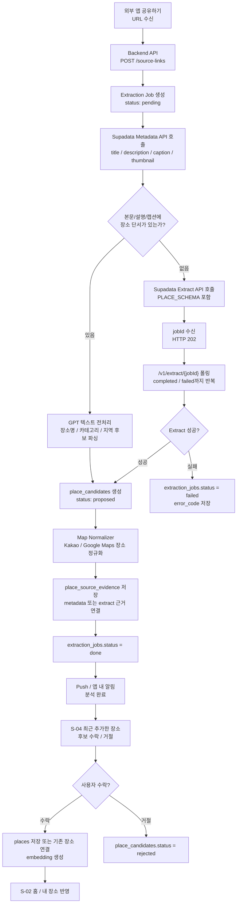
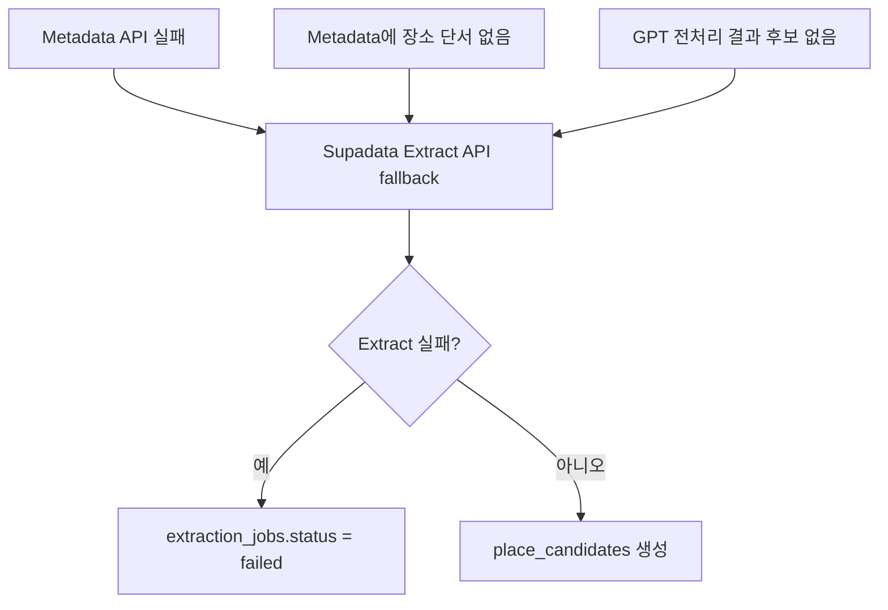

# Pipeline

## UC-02 · 링크 수신 및 장소 분석 파이프라인



## 단계별 책임

| 단계 | 처리 | 설명 |
| --- | --- | --- |
| 1 | 링크 수신 | 모바일 Share Extension / Share Intent가 URL을 앱으로 전달하고 서버에 분석 잡을 생성한다. |
| 2 | Metadata 우선 호출 | Supadata Metadata API로 제목, 설명, 캡션, 썸네일 등 저비용 텍스트/메타 정보를 먼저 확인한다. |
| 3 | 텍스트 기반 후보 생성 | Metadata 본문에 장소 단서가 있으면 GPT가 텍스트를 정리해 장소명, 카테고리, 지역 후보를 만든다. OCR / VLM 영상 분석은 직접 수행하지 않는다. |
| 4 | Extract fallback | Metadata만으로 후보를 만들 수 없으면 Supadata Extract API를 호출하고 jobId를 폴링해 JSON Schema 기반 장소 후보를 받는다. |
| 5 | 지도 정규화 | 후보 장소는 Kakao / Google Maps로 정규화되어 `place_candidates`와 근거 데이터로 저장된다. |
| 6 | 사용자 확인 | 앱은 S-04에서 후보를 보여주고, 사용자가 수락한 항목만 `places`로 저장하거나 기존 장소와 연결한다. |

## 데이터 산출물

| 산출물 | 생성 시점 | 용도 |
| --- | --- | --- |
| `source_links` | URL 수신 직후 | 제출 URL, 플랫폼, 처리 상태 추적 |
| `extraction_jobs` | 분석 시작 시 | 비동기 분석 상태와 실패 코드 관리 |
| `place_candidates` | Metadata/GPT 또는 Extract 성공 후 | 사용자 확인 전 후보 장소 목록 |
| `place_source_evidence` | 지도 정규화 후 | 후보/장소와 metadata 또는 extract 근거 연결 |
| `places` | 사용자 수락 후 | 정규화된 장소 마스터 저장 |

## 실패 및 fallback



## 클라이언트 관점

프론트엔드는 Supadata 또는 GPT를 직접 호출하지 않는다. 앱은 백엔드 API를 통해 분석 상태와 후보만 조회한다.

```text
POST /source-links
GET /jobs/:job_id
GET /jobs/:job_id/candidates
PATCH /candidates/:candidate_id
POST /candidates/batch
```

