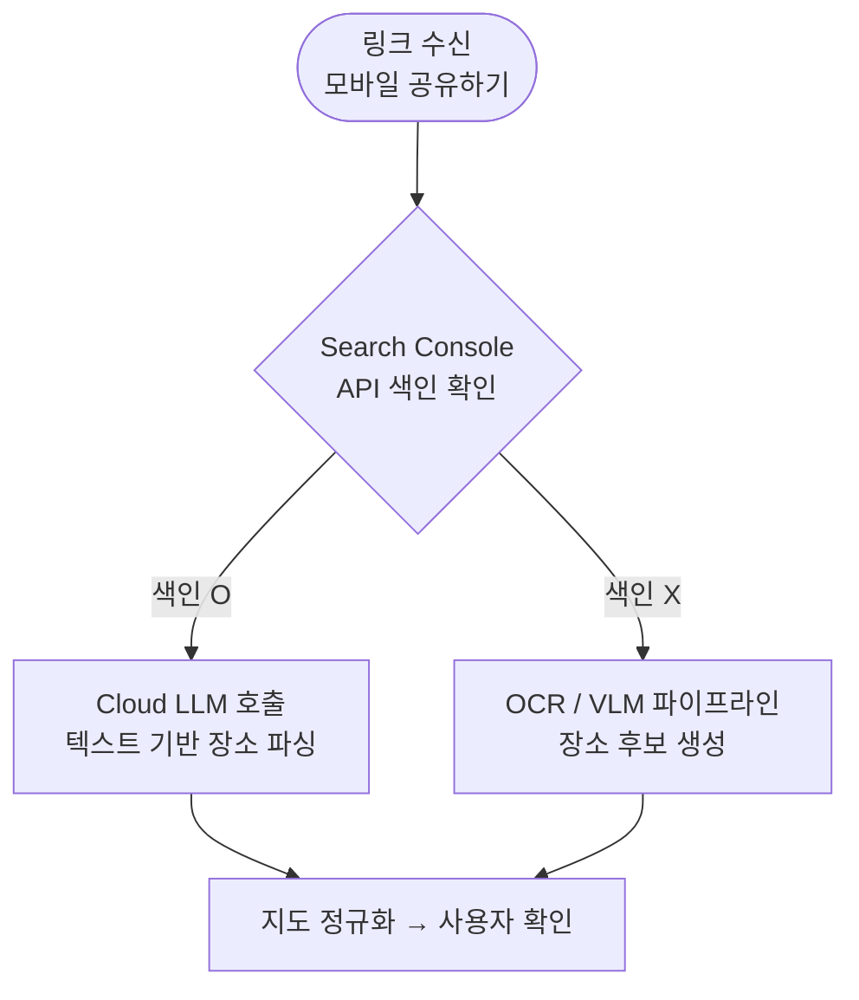

> 플랫폼별(iOS / Android / Web) 구현 상세
> 

## 플랫폼별 구현 방식

### 링크 전처리 파이프라인

사용자가 공유하기를 통해 앱에 링크를 전달하면 아래 흐름으로 처리한다.

### 모바일 (iOS / Android) — MVP

| 플랫폼 | 프레임 추출 API | 백그라운드 처리 |
| --- | --- | --- |
| iOS | AVAssetImageGenerator | BackgroundTasks |
| Android | MediaMetadataRetriever | WorkManager |

**공통 구현 원칙:**

- Share Extension (iOS) / Share Intent (Android)으로 링크 수신
- Google Search Console 색인 확인 후 LLM 또는 OCR/VLM 분기
- OCR/VLM 경로: 프레임 상한 설정 (최대 10프레임), perceptual hash 기반 중복 제거
- 업로드 완료 후 로컬 프레임 즉시 삭제
- 분석 작업은 앱 백그라운드 전환 후에도 지속되어야 함

### 지도 / 블로그 입력

- 구조화 데이터(제목, 주소, 해시태그) 기반 후보 생성
- 지도 URL의 경우 place ID 직접 추출 가능하면 정규화 단계 단축

### 웹 (MVP 이후)

> 웹은 장소 추출 기능을 제공하지 않는다. 모바일에서 생성된 일정의 조회, 편집, 공유 기능만 제공한다.
>