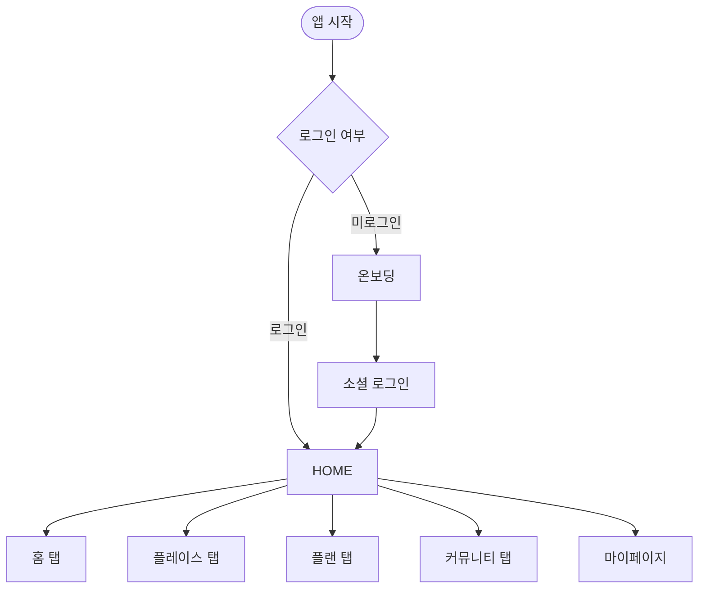
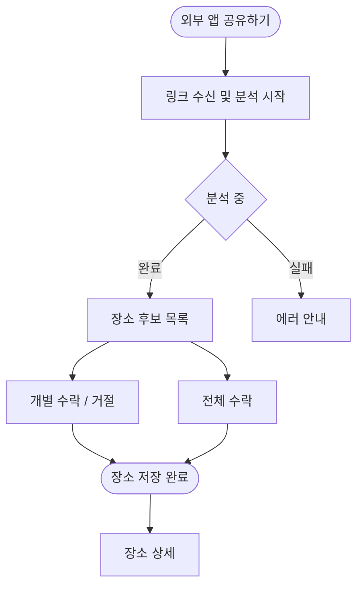
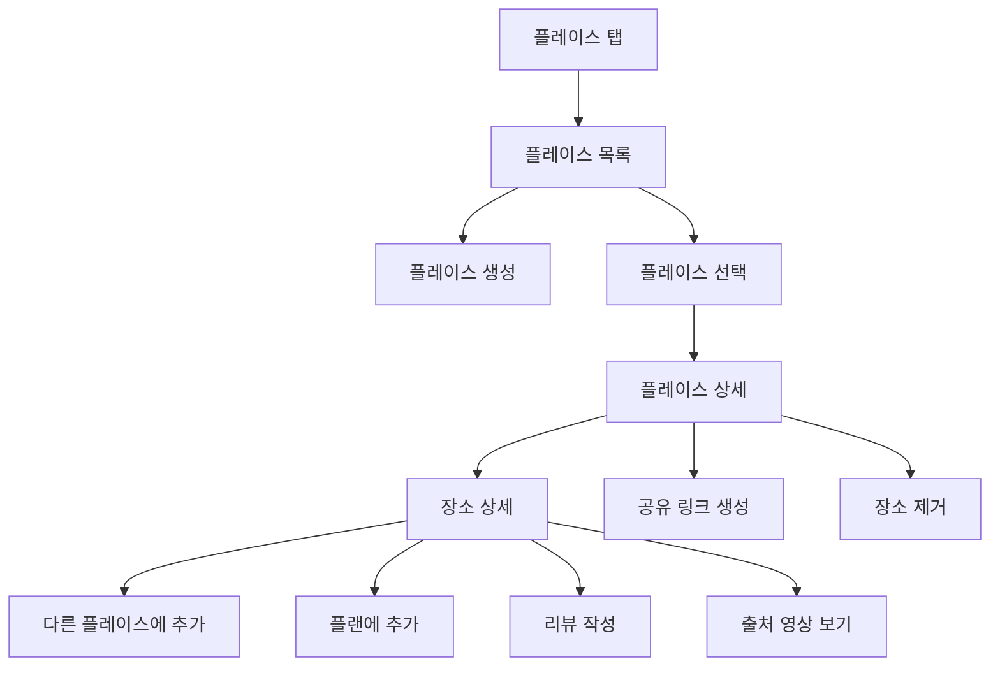
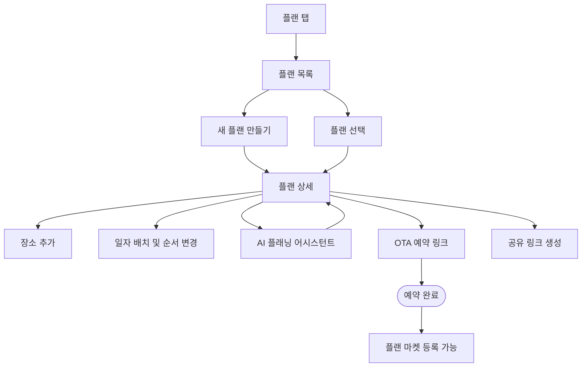
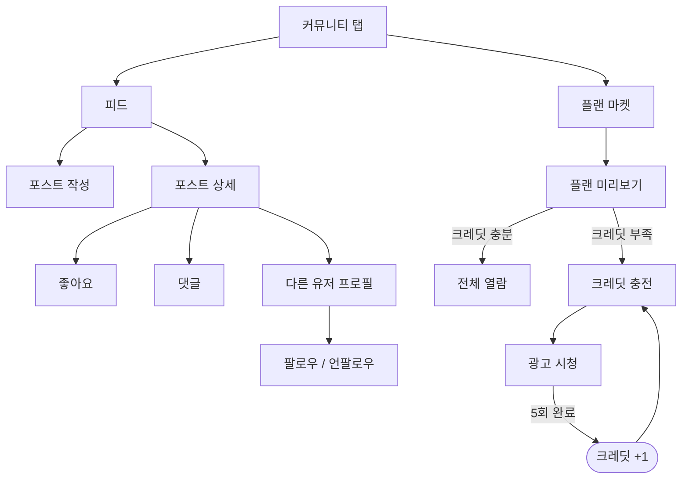
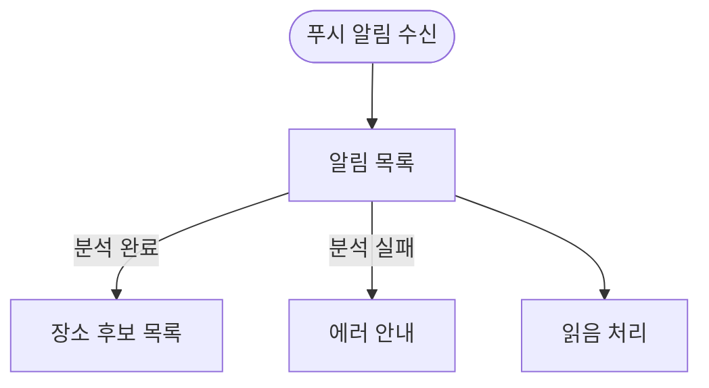
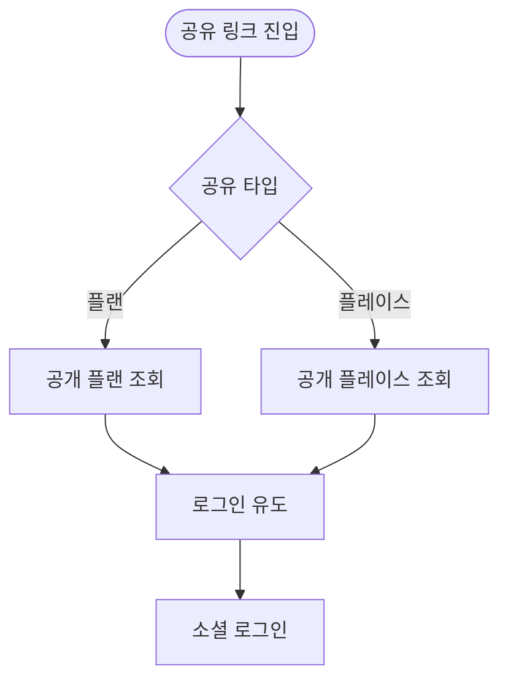

## 전체 앱 흐름

```mermaid
flowchart TD
    LAUNCH([앱 시작]) --> AUTH{로그인 여부}
    AUTH -->|미로그인| ONBOARD[온보딩]
    AUTH -->|로그인| HOME
    ONBOARD --> LOGIN[소셜 로그인]
    LOGIN --> HOME

    HOME --> TAB_HOME[홈 탭]
    HOME --> TAB_PLACE[플레이스 탭]
    HOME --> TAB_PLAN[플랜 탭]
    HOME --> TAB_COMMUNITY[커뮤니티 탭]
    HOME --> TAB_MY[마이페이지]
```

---

## 1. 링크 수집 → 장소 확정

```mermaid
flowchart TD
    SHARE([외부 앱 공유하기]) --> RECEIVE[링크 수신 및 분석 시작]
    RECEIVE --> LOADING{분석 중}
    LOADING -->|완료| CANDIDATES[장소 후보 목록]
    LOADING -->|실패| ERROR[에러 안내]

    CANDIDATES --> ACCEPT[개별 수락 / 거절]
    CANDIDATES --> ACCEPT_ALL[전체 수락]

    ACCEPT --> DONE([장소 저장 완료])
    ACCEPT_ALL --> DONE
    DONE --> PLACE_DETAIL[장소 상세]
```

---

## 2. 플레이스

```mermaid
flowchart TD
    TAB_PLACE[플레이스 탭] --> LIST[플레이스 목록]
    LIST --> CREATE[플레이스 생성]
    LIST --> SELECT[플레이스 선택]
    SELECT --> DETAIL[플레이스 상세]
    DETAIL --> PLACE_ITEM[장소 상세]
    DETAIL --> SHARE[공유 링크 생성]
    DETAIL --> REMOVE[장소 제거]

    PLACE_ITEM --> ADD_TO_COL[다른 플레이스에 추가]
    PLACE_ITEM --> ADD_TO_PLAN[플랜에 추가]
    PLACE_ITEM --> REVIEW[리뷰 작성]
    PLACE_ITEM --> SOURCE[출처 영상 보기]
```

---

## 3. 플랜

```mermaid
flowchart TD
    TAB_PLAN[플랜 탭] --> LIST[플랜 목록]
    LIST --> NEW[새 플랜 만들기]
    LIST --> SELECT[플랜 선택]
    NEW --> DETAIL[플랜 상세]
    SELECT --> DETAIL

    DETAIL --> ADD[장소 추가]
    DETAIL --> ARRANGE[일자 배치 및 순서 변경]
    DETAIL --> AGENT[AI 플래닝 어시스턴트]
    AGENT --> DETAIL

    DETAIL --> OTA[OTA 예약 링크]
    OTA --> CONFIRM([예약 완료])
    CONFIRM --> MARKET_REG[플랜 마켓 등록 가능]
    DETAIL --> SHARE[공유 링크 생성]
```

---

## 4. 커뮤니티

```mermaid
flowchart TD
    TAB_COMMUNITY[커뮤니티 탭] --> FEED[피드]
    TAB_COMMUNITY --> MARKET[플랜 마켓]

    FEED --> WRITE[포스트 작성]
    FEED --> POST[포스트 상세]
    POST --> LIKE[좋아요]
    POST --> COMMENT[댓글]
    POST --> PROFILE[다른 유저 프로필]
    PROFILE --> FOLLOW[팔로우 / 언팔로우]

    MARKET --> PREVIEW[플랜 미리보기]
    PREVIEW -->|크레딧 충분| UNLOCK[전체 열람]
    PREVIEW -->|크레딧 부족| CREDIT[크레딧 충전]
    CREDIT --> AD[광고 시청]
    AD -->|5회 완료| EARNED([크레딧 +1])
    EARNED --> CREDIT
```

---

## 5. 알림

```mermaid
flowchart TD
    PUSH([푸시 알림 수신]) --> NOTIF[알림 목록]
    NOTIF -->|분석 완료| CANDIDATES[장소 후보 목록]
    NOTIF -->|분석 실패| ERROR[에러 안내]
    NOTIF --> READ[읽음 처리]
```

---

## 6. 공개 공유 🔓

```mermaid
flowchart TD
    LINK([공유 링크 진입]) --> TYPE{공유 타입}
    TYPE -->|플랜| PUB_PLAN[공개 플랜 조회]
    TYPE -->|플레이스| PUB_COL[공개 플레이스 조회]
    PUB_PLAN --> CTA[로그인 유도]
    PUB_COL --> CTA
    CTA --> LOGIN[소셜 로그인]
```