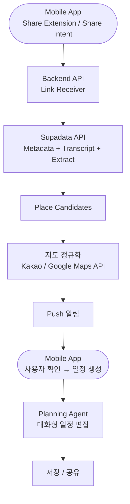

## 전체 구조



---

## 외부 비디오 분석 파이프라인

### Supadata

> 공식 문서: https://docs.supadata.ai
> 

| 항목 | 내용 |
| --- | --- |
| 역할 | 소셜 미디어 URL → 메타데이터 + 트랜스크립트 통합 추출 |
| 지원 플랫폼 | YouTube Shorts, Instagram Reels, TikTok, Facebook, X |
| 추출 데이터 | 영상 제목, 설명, 작성자, 조회수, 트랜스크립트(음성 → 텍스트), 썸네일 URL |
| API 방식 | REST API, 단일 엔드포인트로 플랫폼별 처리 통일 |
| 인증 | API Key |
| 가격 | 무료 100회 / 이후 스케일 기반 유료 |

**API 호출 전략 — URL 패턴 기반 최소 호출**

> Share Sheet로 수신된 URL 패턴을 보고 플랫폼과 콘텐츠 타입을 판별한 뒤, 필요한 API만 호출한다.
> 

**Case 1 — YouTube Shorts / Instagram Reels (영상): 1회 호출**

```
URL: youtube.com/shorts/* 또는 instagram.com/reel/*
  ↓
Extract API 1회 호출 → 장소 JSON 직접 반환
```

**Case 2 — Instagram `/p/*` (타입 미확인): 최대 2회 호출**

```
URL: instagram.com/p/*
  ↓
Metadata API 호출 → type 판별
  ├─ type: "video"    → Extract API 호출 → 장소 JSON
  ├─ type: "carousel" → Extract API 호출 (이미지 OCR 수준, 캡션 보조)
  └─ type: "image"    → Extract API 호출 (시각 분석)
```

**Case 3 — YouTube `/post/*` (이미지 캐러셀): 1회 호출**

```
URL: youtube.com/post/*
  ↓
Metadata API 호출 → 캡션 텍스트 기반 장소 파싱
(Extract API 미지원 — 영상 아님)
```

```jsx
// URL 패턴 분기 로직
async function extractPlaces(url) {
  // Case 1: 영상 URL — Extract 단독 호출
  if (/youtube\.com\/shorts\/|instagram\.com\/reel\//.test(url)) {
    return await supadata.extract({ url, schema: PLACE_SCHEMA });
  }

  // Case 3: YouTube 이미지 캐러셀 — Metadata만
  if (/youtube\.com\/post\//.test(url)) {
    const meta = await supadata.metadata({ url });
    return parsePlacesFromCaption(meta.description);
  }

  // Case 2: Instagram /p/* — Metadata로 type 판별 후 Extract
  if (/instagram\.com\/p\//.test(url)) {
    const meta = await supadata.metadata({ url });
    if (meta.type === 'video' || meta.type === 'carousel' || meta.type === 'image') {
      return await supadata.extract({ url, schema: PLACE_SCHEMA });
    }
  }
}
```

---

> **대안 서비스 (미도입):** Supadata가 정상 동작하지 않는 상황이 발생할 경우 Apify AI Video Data Extractor (`invideoiq/ai-video-data-extractor`) 도입을 검토한다. YouTube, TikTok, Instagram, Facebook, X 등을 지원하며 커스텀 JSON 스키마 기반 AI 분석을 제공한다. 현재는 미사용.
> 

---

### 플랫폼별 파싱 가능 데이터

#### Extract API — YouTube / Instagram 장소 추출 정확도

| URL 패턴 | 콘텐츠 타입 | 시각 분석 | 음성 분석 | API 호출 횟수 |
| --- | --- | --- | --- | --- |
| `youtube.com/shorts/*` | YouTube Shorts (영상) | ✅ | ✅ | **1회** (Extract) |
| `instagram.com/reel/*` | Instagram Reels (영상) | ✅ | ✅ | **1회** (Extract) |
| `instagram.com/p/*` (video) | Instagram 피드 영상 | ✅ | ✅ | **2회** (Metadata → Extract) |
| `instagram.com/p/*` (carousel) | Instagram 이미지 캐러셀 | ⚠️ 제한적 | ❌ 없음 | **2회** (Metadata → Extract) |
| `instagram.com/p/*` (image) | Instagram 단일 이미지 | ✅ | ❌ | **2회** (Metadata → Extract) |
| `youtube.com/post/*` | YouTube 이미지 캐러셀 | ❌ Extract 미지원 | ❌ | **1회** (Metadata, 캡션만) |

**Extract API 동작 방식**

- 요청 시 항상 **HTTP 202 (jobId)** 반환 → 비동기 작업
- jobId로 폴링 (`/v1/extract/{jobId}`) → `completed` 또는 `failed` 때까지 1초 간격 폴링 권장
- 결과 `data` 필드에 JSON Schema 기준 구조화 데이터 반환
- **schema 직접 제공** 시 일관된 출력 보장 (프로덕션 권장)

**RoundTrip 장소 추출용 Schema**

```json
{
  "type": "object",
  "properties": {
    "places": {
      "type": "array",
      "description": "영상에서 언급되거나 화면에 등장하는 여행 장소 목록",
      "items": {
        "type": "object",
        "properties": {
          "name": { "type": "string", "description": "장소명 (현지어 + 한국어)" },
          "category": { "type": "string", "enum": ["관광명소", "맛집", "카페", "숙박", "자연", "기타"] },
          "region": { "type": "string", "description": "도시, 국가 (예: 오사카, 일본)" },
          "timestamp": { "type": "string", "description": "영상 등장 시점 (예: 0:12)" },
          "confidence": { "type": "number", "description": "0.0~1.0" }
        },
        "required": ["name", "category", "region"]
      }
    }
  },
  "required": ["places"]
}
```

---

## 구성 요소

| 컴포넌트 | 역할 |
| --- | --- |
| Mobile App (iOS/Android) | 링크 수신, 결과 확인 UI, 일정 편집 |
| Backend API | 링크 전처리, 파이프라인 오케스트레이션 |
| Supadata API | YouTube / Instagram 등 URL → 메타데이터 + 트랜스크립트 통합 추출 (주 서비스) |
| Apify Video Extractor | Supadata 장애 시 폴백 트랜스크립트 + 메타데이터 추출 |
| Map Normalizer | Kakao / Google Maps API로 장소 정규화 |
| Job Queue | 비동기 처리, 백그라운드 복원 |

---

## 저장소

| 저장소 | 용도 |
| --- | --- |
| PostgreSQL + PostGIS + pgvector | 메인 DB (장소, 일정, 사용자, 임베딩) |
| Redis | 작업 상태 캐시 |