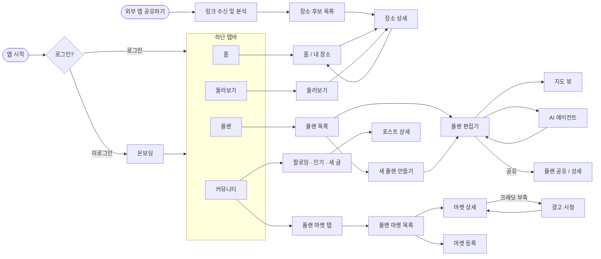
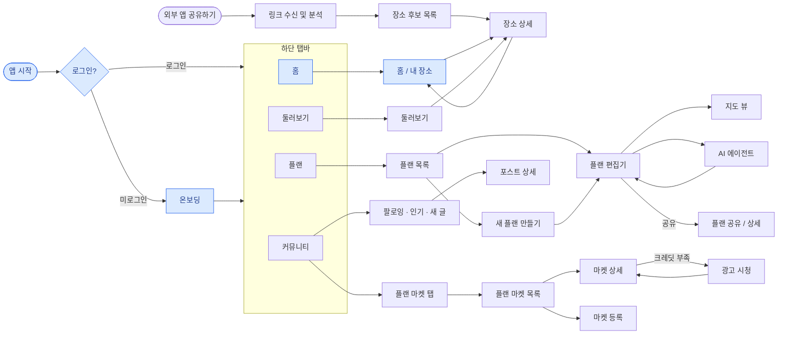
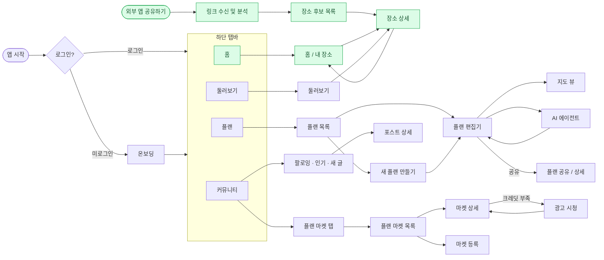
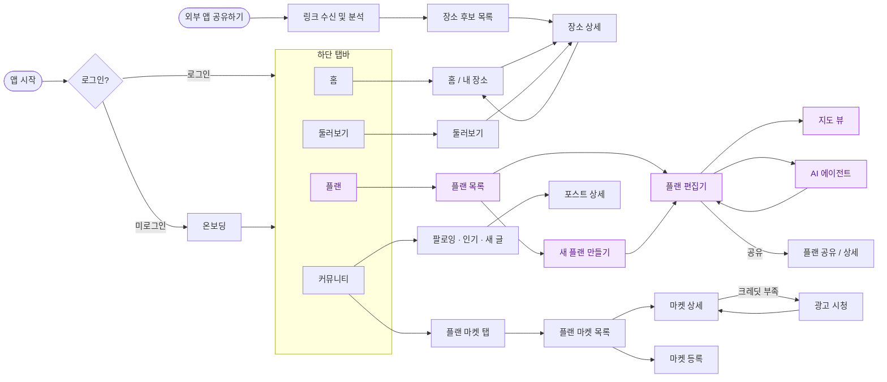
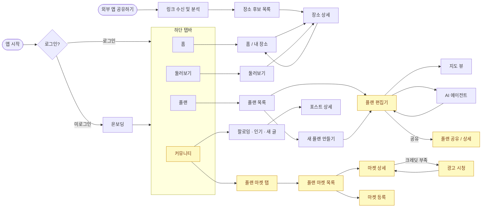
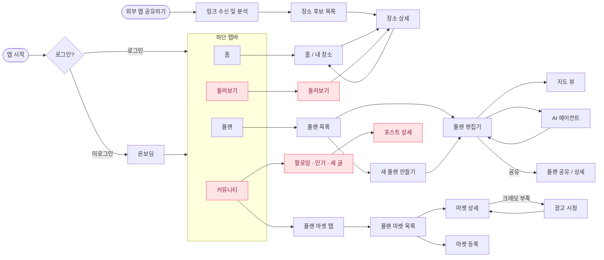

## 전체 화면 흐름

---

## UC 01 · 온보딩 & 홈

> 앱 첫 진입부터 홈 화면까지의 흐름. 온보딩에서 서비스를 소개하고, 홈에서 저장한 장소를 한눈에 확인.
> 

| 단계 | 화면 | 설명 |
| --- | --- | --- |
| 1 | 온보딩 | 슬라이드 3장으로 핵심 가치 소개 후 소셜 로그인 유도 |
| 2 | 홈 / 내 장소 | 저장한 장소를 플레이스 탭별로 탐색. 최근 추가 장소 토스트 표시 |

---

## UC 02 · 장소 저장 & 관리

> 인스타그램, 블로그, 유튜브 등 외부 앱에서 링크를 공유하면 AI가 장소를 자동 추출해 저장.
> 

| 단계 | 화면 | 설명 |
| --- | --- | --- |
| 1 | 링크 수신 및 분석 | OS Share Sheet에서 앱 선택 시 트리거. 분석 잡 즉시 생성 |
| 2 | 장소 후보 목록 | AI 추출 장소 카드 확인, 개별/전체 수락·거절 |
| 3 | 장소 상세 | 지도 확인, 원본 영상 이동, 최종 수락·거절 |
| 4 | 홈 반영 | 수락된 장소가 플레이스에 저장되고 홈 토스트로 알림 |

---

## UC 03 · 플랜 생성 & 편집

> 저장한 장소를 모아 여행 플랜을 만들고, 일자별로 편집하거나 AI 에이전트에게 자동 일정 구성을 맡길 수 있음.
> 

| 단계 | 화면 | 설명 |
| --- | --- | --- |
| 1 | 플랜 목록 | 하단 플랜 탭 진입. 진행 중·완성된 플랜 관리 허브 |
| 2 | 새 플랜 만들기 | Step 1 기본 정보(이름·여행지·날짜·인원) → Step 2 장소 선택 |
| 3 | 플랜 편집기 | 장소 일자 배치, 드래그 순서 변경, OTA 예약 연결 |
| 4 | 지도 뷰 | 전체 장소를 지도로 조망하며 일정 동시 확인 |
| 5 | AI 에이전트 | 자연어로 동선 최적화·유사 장소 추천·일정 수정 요청 |

---

## UC 04 · 플랜 공유 & 마켓

> 완성한 플랜을 다른 사용자와 공유하거나 마켓에 등록해 수익을 얻을 수 있음. 크레딧으로 프리미엄 플랜을 열람.
> 

| 단계 | 화면 | 설명 |
| --- | --- | --- |
| 1 | 플랜 공유 / 상세 | 플랜 편집기에서 공유 버튼 탭. 공개 URL 생성, 비로그인 열람 가능 |
| 2 | 플랜 마켓 목록 | 커뮤니티 탭 내 플랜 마켓 탭 진입. 실제 여행 플랜 탐색 |
| 3 | 마켓 상세 | 미리보기 무료, 전체 열람 시 크레딧 1개 차감 |
| 4 | 광고 시청 | 광고 5회 완료 시 크레딧 1개 적립 |
| 5 | 마켓 등록 | OTA 예약 완료 플랜만 등록 가능, 타인 열람 시 크레딧 적립 |

---

## UC 05 · 커뮤니티 & 탐색

> 다른 여행자의 피드를 팔로우하고, 둘러보기에서 여행지별 콘텐츠를 탐색. 포스트에 좋아요·댓글로 소통.
> 

| 단계 | 화면 | 설명 |
| --- | --- | --- |
| 1 | 둘러보기 | 하단 둘러보기 탭 진입. 취향 기반 유사 장소 추천, 카테고리·국가 필터 |
| 2 | 커뮤니티 피드 | 하단 커뮤니티 탭 진입. 팔로잉·인기·새 글 탭 전환, 포스트 작성 |
| 3 | 포스트 상세 | 좋아요·댓글 소통, 태그된 장소·플랜으로 이동 |
| 4 | 유저 프로필 | 다른 여행자 팔로우·언팔로우 |